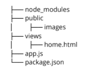
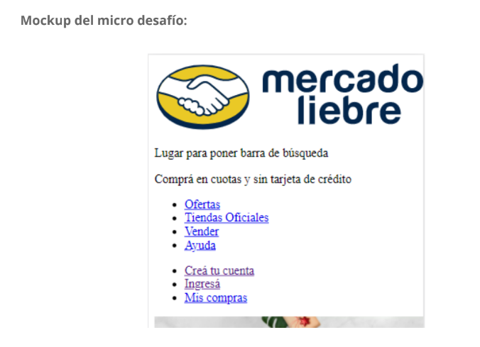
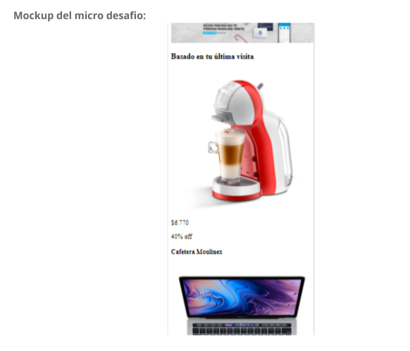
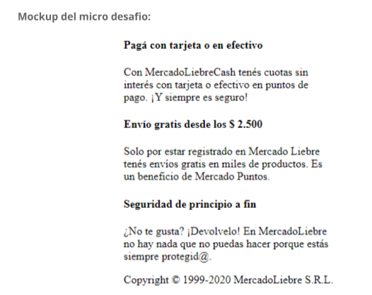

# Trabajo Practico nimero 1 - Mercado Liebre - Armando la  estructura de un sitio Web

**************************************************************************** 

## Desafio 1 - Crear la siguiente estructura de carpetas para trabajar.

*****************************************************************************

## Desafio 2 - Crear un archivo home.html, el archivo debera tener las siguientes secciones:

- header
- main
- footer

### header debera tener:
- Logo.
- Lugar para poner la barra de busqueda.
- Comprá en cuotas y sin tarjeta de crédito.
- Barra de navegación que posea las siguientes opciones:
     - Ofertas.
     - Tiendas Oficiales.
     - Vender.
     - Ayuda.
     - Creá tu cuenta.
     - Ingresá.
     - Mis compras.

**********************************************************************************************
- Mockup del desafio:

    

***********************************************************************************************

### main (productos) debera tener:
- Sección: Basado en tu última visita:
     - imagen de la cafetera
     - $6.770
     - 40% OFF
     - Cafetera Moulinex

     - imagen de MacBook
     - $230.000
     - 20% off
     - MacBook Pro 2019

     - imagen del Samsung Galaxy
     - $70.500
     - 10% off
     - Samsung Galaxy S10

     - imagen del SmartTv
     - $23.200
     - 5% off
     - SmartTv Samsung 43"
- Sección de Ofertas_
     - imagen de la cafetera
     - $6.770
     - 40% off
     - Cafetera Moulinex

     - imagen de MacBook
     - $230.000
     - 20% off
     - MacBook Pro 2019

     - imagen Samsung
     - $70.500
     - 10% off
     - Samsung Galaxy S10

     - imagen SmarTv
     - $23.200
     - 5% off
     - SmartTv Samsung 43"

************************************************************************************************
- Mockup del desafio:

************************************************************************************************

##Desafio 3 - Footer (Pie de pagina).

### Footer (pie de pagina) debera tener:
- Pagá con tarjeta o en efectivo
Con Mercado Liebre Cash, tenés cuotas sin interés con tarjeta o efectivo en
puntos de pago. ¡Y siempre es seguro!

- Envío gratis desde $ 2.500
Solo por estar registrad@ en Mercado Liebre tenés envíos gratis en miles de
productos. Es un beneficio de Mercado Puntos. 

************************************************************************************************
- Mockup del desafio:

*************************************************************************************************
